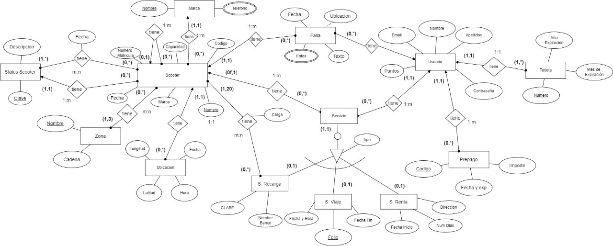
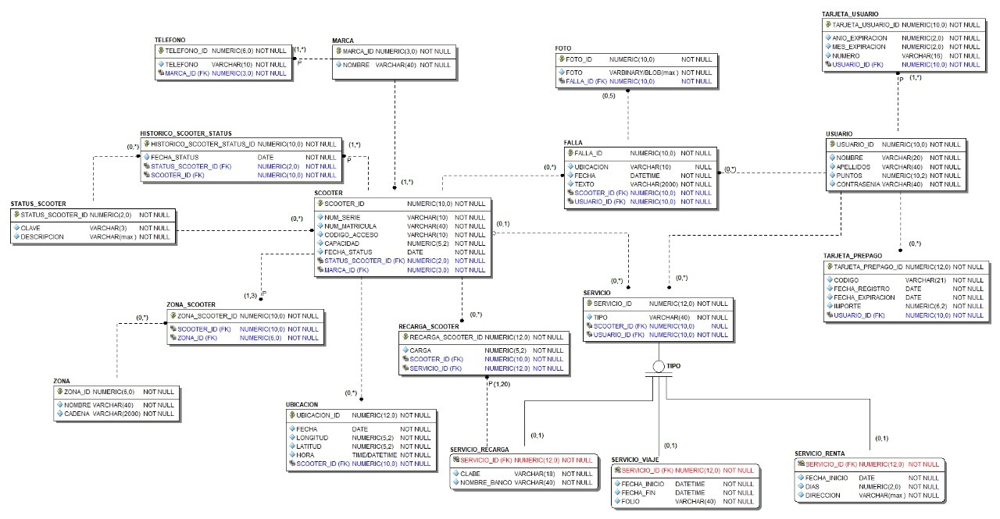

# ScooterAnywhere
Una empresa de scooters se ha instalado en la ciudad, se debe desarrollar una base de datos para poder tener control sobre este nuevo servicio.

## Autores:
- Diaz Pacheco Jose Juan
- Moreno Peralta Angel Eduardo

## Scripts

### Creacion del modelo
- s-00-main.sql (completo)
- s-01-usuarios.sql (completo)
- s-02-entidades.sql (completo)
- s-03-tablas-temporales.sql (completo)
- s-04-tablas-externas.sql (completo)
- s-05-secuencias.sql (completo)
- s-06-indices.sql (completo)
- s-07-sinonimos.sql (completo)
- s-08-vistas.sql (completo)
- s-09-carga-inicial.sql (completo)
- s-10-consultas.sql (completo)

### Triggers, Funciones y Procedimientos
- s-11-tr-historico_actualizacion.sql (completo)
- s-11-tr-servicio.sql (completo)
- s-11-tr-telefono.sql (completo)

- s-13-p-nuevo-servicio.sql (completo)
- s-13-p-verificacion-falla.sql (completo)

- s-15-fx-calculo-pago.sql (completo)
- s-15-fx-carga-imagen.sql (completo)
- s-15-fx-creacion-folio.sql (completo)

### Pruebas de Triggers, Funciones y Procedimientos
- s-12-tr-historico_actualizacion-prueba.sql (completo)
- s-12-tr-servicio-prueba.sql (completo)
- s-12-tr-telefono-prueba.sql (completo)

- s-14-p-nuevo-servicio-prueba.sql (completo)
- s-14-p-verificacion-falla-prueba.sql (completo)

- s-16-fx-calculo-pago-prueba.sql (completo)
- s-16-fx-carga-imagen-prueba.sql (completo)
- s-16-fx-creacion-folio-prueba.sql (completo)

### LOBS y cursores

Estos archivos, no son creados pero son añadidas estas funcionalidades en los anteriores scripts, se usan cursores y hay una funcion dedicada a Lobs.
## Modelos

### Modelo relacional

### Modelo fisico

